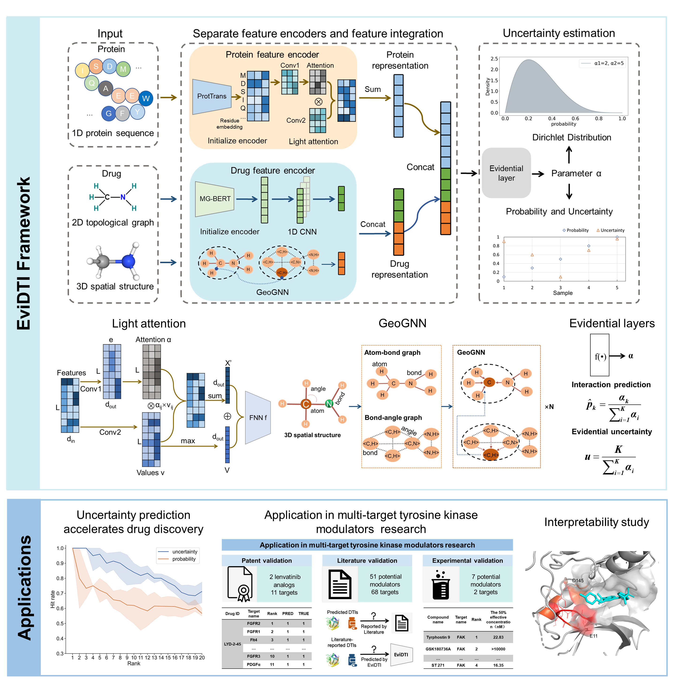

# EviDTI
This is the implementation of EviDTI: Evidential Deep Learning for Guided Drug-Target Interaction Prediction


## catalogue

- [Installation](#Installation)
- [Dataset](#Dataset)
- [Train](#Train)
- [Prediction](#Prediction)
- [License](#License)


## Installation
EviDTI is built on Python3, we recommend using a virtual conda
 environment as enviroment management for the installation of 
 EviDTI and its dependencies. 
 The virtual environment can be created as follows:
```bash
conda create -n evidti python==3.8
conda activate evidti
```
Download the source code of EviDTI from GitHub:
```bash
git clone https://github.com/username/my-project.git
```
Install EviDTI dependencies as following:
```bash
conda env create -f environment.yaml
```
## Dataset
The data feature file used in this study can be download from the link 
https://zenodo.org/records/13984740
## Train
### Feature extraction
Firstly, seqence features of proteins, 
2D as well as 3D input features of drugs need to be generated  
Seqence features of proteins can be generated by ```extract_p_emb.py```
```bash
python extract_p_emb.py
```
2D input features of drugs can be generated by ```extract_drug_2d_emb.py```
```bash
python extract_drug_2d_emb.py
```
3D input features of drugs can be generated by ```extract_drug_3d_emb.py```
```bash
python extract_drug_3d_emb.py
```
### Train

Multiple hyperparameters can be selected in ```bashconfigs/XX.yaml``` and ```XX_configs.py```.  
XX Replace with drugbank, davis or kiba depending on the dataset.  

Run the main-drugbank.py to train the drugbank dataset
```bash
python main_drugbank.py --cfg configs/drugbank.yaml --data drugbank --split random
```
It's similar for kiba and davis.
```bash
python main_davis.py --cfg configs/davis.yaml --data davis --split random
```
```bash
python main_KIBA.py --cfg configs/kiba.yaml --data kiba --split random
```
After model training starts, the progress bar will be 
automatically shown on your command line， 
and the trained model parameters will be saved in 
"runs" dictory for the best epoch.
## Prediction
Model parameters can be found under the runs folder
```bash
python infernce.py
```
After predicting with your well trained model, 
the predicting output will be saved in "runs" dictory.
## License
This project is covered under the Apache 2.0 License.

